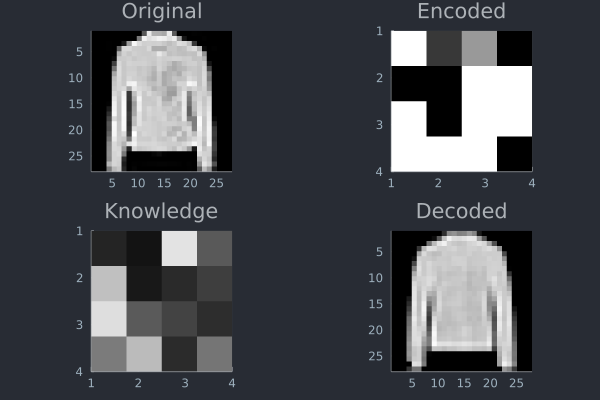

# Dependencies


```julia
using CSV, DataFrames, Random
```


```julia
using Flux
```


```julia
using CUDA
```


```julia
using Plots
```


```julia
gr()
theme(:wong);
```

# Data loading


```julia
function splitdf(df, pct)
   @assert 0 <= pct <= 1
   ids = collect(axes(df, 1))
   shuffle!(ids)
   sel = ids .<= nrow(df) .* pct
   return view(df, sel, :), view(df, .!sel, :)
end;
```


```julia
df = "fashion-mnist_train.csv" |> CSV.File |> DataFrame;
df_train, df_valid = splitdf(df, 0.666)
df_test = "fashion-mnist_test.csv" |> CSV.File |> DataFrame;
```


```julia
labels = Dict(
    0 => "T-shirt",
    1 => "Trouser",
    2 => "Pullover",
    3 => "Dress",
    4 => "Coat",
    5 => "Sandal",
    6 => "Shirt",
    7 => "Sneaker",
    8 => "Bag",
    9 => "Ankle boot"
);
```


```julia
function load_y(df)
    y = df[:, :label]
    Flux.onehotbatch(y, 0:9)
end

y_train = load_y(df_train) |> y -> Flux.label_smoothing(y, 0.2f0) |> gpu
y_valid = load_y(df_valid) |> gpu;
y_test= load_y(df_test) |> gpu;
```


```julia
function load_x(df)
    x = select(df, Not(:label)) |> Matrix |> permutedims
    x = reshape(x, 28, 28, 1, :) / 255
    convert(Array{Float32,4}, x) |> m -> permutedims(m, (2,1,3,4))
end

x_train = load_x(df_train) |> gpu
x_valid = load_x(df_valid) |> gpu;
x_test = load_x(df_test) |> gpu;
```

# Custom training function


```julia
function train!(loss, ps, data, opt)
	local training_loss
	for d in data
    	gs = gradient(ps) do
      		training_loss = loss(d...)
      		return training_loss
		end
    # Insert whatever code you want here that needs training_loss, e.g. logging.
    # E.g. logging with TensorBoardLogger.jl as histogram so you can see if it is becoming huge.
    Flux.update!(opt, ps, gs)
    # Here you might like to check validation set accuracy, and break out to do early stopping.
	end
    training_loss
end;
```


```julia
predict(x) = labels[Flux.onecold(model(cat(x; dims=4)), 0:9)[1]]
get_label(y) = labels[Flux.onecold(y, 0:9)[1]]

function get_acc(model)
    function acc(x, y) 
        ŷ = model(x) |> Flux.onecold
        cy = y |> Flux.onecold
        sum(ŷ .== cy) / length(cy)
    end
end;
```

# CNN


```julia
model = Chain(
    Conv((3, 3), 1 => 32, relu)
    , AdaptiveMaxPool((14, 14))
    , Conv((3, 3), 32 => 32, relu)
    , Flux.Dropout(0.2)
    , Flux.flatten
    , Dense(4608, 32, relu)
    , Dense(32, 10)
    , softmax
) |> gpu

ps = params(model)

loss(x, y) = Flux.mse(model(x), y)

opt = ADAM()

data = Flux.DataLoader((x_train, y_train), batchsize=512, shuffle=true) |> gpu;
```


```julia
training_error = []
# vde = []
# tse = []
# ats = []
cnn_acc = get_acc(model)
@time for epoch=1:75
	push!(training_error, train!(loss, ps, data, opt))
	# push!(vde, loss(x_valid, y_valid))
	# push!(tse, loss(x_test, y_test))
	# push!(ats, cnn_acc(x_test, y_test))
end
```

    287.748686 seconds (222.56 M allocations: 12.519 GiB, 1.71% gc time, 26.95% compilation time)


```julia
plot(
    plot(training_error, title="Training error")
    # , plot(vde, title="Validation error")
    # , plot(tse, title="Test error")
    # , plot(ats, title="Test accuracy")
    , legend = false
)
```


    

    


## Evaluation


```julia
cnn_acc(x_test, y_test)
```


    0.8947


```julia
idx = 21
xi = x_test[:, :, 1, idx]
ŷi = xi |> predict
yi = y_test[:, idx] |> get_label
plot(Gray.(xi), title="y=$(yi); ŷ=$ŷi")
```


    

    


# Autoencoder


```julia
function x_autoenc(df)
    select(df, Not(:label)) |> Matrix |> permutedims |> m -> convert(Matrix{Float32}, m / 255) |> gpu;
end;

x_train_autoenc = df_train |>  x_autoenc
x_test_autoenc = df_test |> x_autoenc;
```

## Compression and decompression


```julia
enc = Chain(
    Dense(784, 1024, relu)
    , Dense(1024, 256, relu)
    , Dense(256, 16, relu)
) |> gpu

knw = Chain(
    Dense(16, 16, σ)
) |> gpu

dec = Chain(
    Dense(16, 256, relu)
    , Dense(256, 1024, relu)
    , Dense(1024, 784, relu)
) |> gpu

auto = Chain(
    enc
    , knw
    , dec
) |> gpu;
```


```julia
data_autoenc = Flux.DataLoader((x_train_autoenc, x_train_autoenc), batchsize=1024, shuffle=true) |> gpu;
```


```julia
loss_autoenc(x, y) = Flux.mse(auto(x), y);
```

First I train the encoding, knowledge and decoding networks


```julia
h = []
@time for e=1:200
    push!(h, train!(loss_autoenc, params(auto), data_autoenc, ADAM()))
end;
```

     83.250845 seconds (40.67 M allocations: 2.749 GiB, 2.35% gc time, 0.09% compilation time)


```julia
h |> plot
```


    

    


```julia
og = x_test_autoenc[:, 97]
en = enc(og)
kn = knw(en)
dc = dec(kn)
plot(
    plot(
        Gray.(reshape(og, 28, 28)'), title="Original"
    ),
    plot(
        Gray.(reshape(en, 4, 4)'), title="Encoded"
    ),
    plot(
        Gray.(reshape(kn, 4, 4)'), title="Knowledge"
    ),
    plot(
        Gray.(reshape(dc, 28, 28)'), title="Decoded"
    )
)
```


    

    


## Classification


```julia
clf = Chain(
    Dense(16, 32, relu)
    , Dense(32, 10)
    , softmax
) |> gpu

m2 = Chain(
    enc
    , knw
    , clf
) |> gpu;
```


```julia
data_autoenc_classif = Flux.DataLoader((knw(enc(x_train_autoenc)), y_train), batchsize=1024, shuffle=true) |> gpu;
```


```julia
loss_autoenc_classif(x, y) = Flux.mse(clf(x), y);
```

Then I train the classification network with the training data compressed by the encoding and knowledge networks


```julia
hc = []
@time for e=1:200
    push!(hc, train!(loss_autoenc_classif, params(clf), data_autoenc_classif, ADAM()))
end;
```

      5.598522 seconds (13.26 M allocations: 897.456 MiB, 2.91% gc time, 1.39% compilation time)


```julia
hc |> plot
```


    

    


## Evaluation

At this point I could use the m2 or the clf models.

The m2 model takes a 28x28 image as an input, compresses it with the encoding and knowledge networks, and then classifies it.

The clf model takes a compressed 4x4 image and classifies it.


```julia
compressed_x = x_test_autoenc |> enc |> knw
```


    16×10000 CuArray{Float32, 2, CUDA.Mem.DeviceBuffer}:
     0.940425  0.369556   0.304466  0.342902   …  0.534504   0.647912   0.729091
     0.169327  0.476021   0.187799  0.0720671     0.363696   0.0770572  0.0871172
     0.341197  0.0354029  0.538205  0.338364      0.814999   0.48862    0.540134
     0.803808  0.400577   0.49707   0.232363      0.0970822  0.6102     0.216925
     0.25419   0.622433   0.39763   0.370179      0.311225   0.31504    0.537176
     0.13793   0.963279   0.253031  0.642356   …  0.79141    0.0390155  0.0916268
     0.28535   0.0985808  0.380226  0.190825      0.310181   0.168932   0.0828913
     0.528243  0.768223   0.463189  0.176289      0.0415898  0.0342672  0.588168
     0.579654  0.0354131  0.733973  0.828916      0.137161   0.84145    0.753332
     0.083266  0.30258    0.494886  0.09353       0.0138732  0.157423   0.0921301
     0.127386  0.104193   0.45664   0.145326   …  0.0288254  0.151292   0.0605917
     0.156033  0.225684   0.316097  0.392282      0.526755   0.287957   0.0411403
     0.953783  0.349266   0.450268  0.88071       0.933882   0.95299    0.867055
     0.42933   0.556401   0.650649  0.706159      0.0509424  0.271593   0.567137
     0.392897  0.356192   0.416983  0.44909       0.292131   0.163725   0.318824
     0.111558  0.750463   0.376389  0.348271   …  0.875475   0.599237   0.678546


```julia
accuracy_autoenc = get_acc(clf)
accuracy_autoenc(compressed_x, y_test)
```


    0.8382


